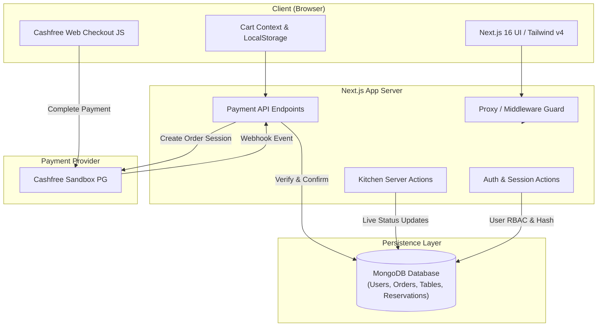

# 🍽️ DineDesk — Modern Full-Stack Restaurant & Dining Platform

[](https://github.com/amith6491-netizen/CODSOFT_TASK_02)
[](https://nextjs.org/)
[](https://react.dev/)
[](https://www.typescriptlang.org/)
[](https://tailwindcss.com/)
[](https://www.mongodb.com/)
[](https://www.docker.com/)
[](./LICENSE)

> Developed as part of the **CodSoft Web Development Internship (Task 02)**.
> **DineDesk** is an end-to-end dining and food ordering platform featuring multi-restaurant browsing, table reservations, live menu search, shopping cart management, Cashfree Sandbox payment processing, an active Kitchen Display System (KDS), and role-based access control.

---

## 📑 Table of Contents

- [Overview](#-overview)
- [Key Features](#-key-features)
- [Tech Stack](#-tech-stack)
- [Project Architecture](#-project-architecture)
- [Folder Structure](#-folder-structure)
- [Prerequisites](#-prerequisites)
- [Environment Configuration](#-environment-configuration)
- [Getting Started](#-getting-started)
  - [Local Setup](#local-setup)
  - [Docker Compose Setup](#docker-compose-setup)
- [Cashfree Sandbox Payment Integration](#-cashfree-sandbox-payment-integration)
- [Admin & Role Management](#-admin--role-management)
- [Available Scripts](#-available-scripts)
- [API Endpoints Reference](#-api-endpoints-reference)
- [License](#-license)

---

## 🌟 Overview

**DineDesk** bridges the gap between high-end culinary hospitality and modern digital ordering. It provides guests with a seamless journey from discovering fine dining partner restaurants, filtering dishes, and booking tables to checking out via secure digital payment gateways (UPI, Cards, Net Banking) or Cash on Delivery. For restaurant staff, it includes a live **Kitchen Display System (KDS)** to monitor, prioritize, and dispatch customer orders in real time.

---

## ✨ Key Features

### 🏨 1. Multi-Restaurant Discovery & Showcases
- Explore top partner restaurants (e.g., *Shiro Pan-Asian & Sushi Lounge*, *Le Cirque Signature*, *Jamavar Royal Dining*, *Citrus Mediterranean Brasserie*).
- Individual destination pages detailing cuisine tags, location, ratings, delivery estimates, pricing for two, and specialized culinary highlights.

### 📋 2. Interactive Menu & Real-Time Search
- Curated menu across multiple categories: **Starters**, **Mains**, **Desserts**, and **Beverages**.
- Cross-filtering by restaurant and category with instant, debounced search.
- High-fidelity dish cards with pricing, descriptions, and high-resolution visuals.

### 🛒 3. Cart & Order Calculation
- Real-time cart state managed through React Context and persisted in `localStorage`.
- Item quantity increments, decrements, item deletion, and automated GST/tax calculation.
- Support for Dine-In and Takeaway dining options.

### 💳 4. Cashfree Sandbox Payment Gateway
- Integration with **Cashfree Payments Sandbox** SDK (`@cashfreepayments/cashfree-js`).
- Supports simulated UPI (Google Pay, PhonePe, Paytm, Any UPI), Cards, Net Banking, and Cash on Delivery (COD).
- Cryptographic server-side order total recalculation and verification endpoint (`/api/payments/verify`).
- Asynchronous payment notification handling via Cashfree Webhooks (`/api/payments/webhook`).

### 📅 5. Dining Table Reservation System
- Interactive booking system allowing guests to select date, time slots, and guest count.
- Automatic table assignment and validation against venue capacity.
- Instant booking pass confirmation with dedicated table ID.

### 👨‍🍳 6. Live Kitchen Display System (KDS)
- Dedicated kitchen dashboard at `/kitchen` for culinary staff.
- Visual order cards tracking order status through:
  $$\text{PENDING} \longrightarrow \text{PREPARING} \longrightarrow \text{READY} \longrightarrow \text{COMPLETED}$$
- Instant status transition actions and chronological dispatch queue.

### 🔐 7. Authentication & Role-Based Access Control (RBAC)
- Custom authentication system using **JWT sessions** (`jose`) encrypted into secure HTTP-only cookies.
- Password encryption with `bcryptjs`.
- Distinct role enforcement: `CUSTOMER`, `STAFF`, and `ADMIN`.
- Route guard proxy (`src/proxy.ts`) preventing unauthorized access to staff-only views.

### 👤 8. User Profile Management
- Editable user profile at `/profile` (name, phone number, delivery address/location, and avatar URL).

---

## 🛠️ Tech Stack

| Layer | Technologies |
| :--- | :--- |
| **Frontend** | [Next.js 16 (App Router)](https://nextjs.org/), [React 19](https://react.dev/), [TypeScript](https://www.typescriptlang.org/) |
| **Styling** | [Tailwind CSS v4](https://tailwindcss.com/), Modern CSS Glassmorphism, [Lucide React Icons](https://lucide.dev/) |
| **Typography** | Google Fonts ([Geist](https://vercel.com/font), [Outfit](https://fonts.google.com/specimen/Outfit)) |
| **State Management** | React Context API + LocalStorage Synchronization |
| **Backend & APIs** | Next.js Server Actions & API Route Handlers |
| **Database & ODM** | [MongoDB 7.0+](https://www.mongodb.com/) via [Mongoose 9](https://mongoosejs.com/) |
| **Authentication** | Stateless JWT via `jose` + Password Hashing via `bcryptjs` |
| **Payments** | [Cashfree Payments Sandbox](https://www.cashfree.com/) (`@cashfreepayments/cashfree-js`) |
| **DevOps & Containers**| [Docker](https://www.docker.com/), [Docker Compose](https://docs.docker.com/compose/) with volume sync & healthchecks |

---

## 📐 Project Architecture



---

## 📂 Folder Structure

```
CODSOFT_TASK_02/
├── .env.example                # Template for environment variables
├── Dockerfile                  # Multi-stage production container build
├── docker-compose.yml          # Container configuration for Next.js app & MongoDB
├── eslint.config.mjs           # ESLint configuration
├── next.config.ts              # Next.js runtime configuration
├── package.json                # Project dependencies and script declarations
├── postcss.config.mjs          # PostCSS configuration for Tailwind v4
├── tsconfig.json               # TypeScript compiler configuration
├── public/                     # Static assets, hero images, dish images, restaurant photos
├── scripts/                    # Maintenance & administration scripts
│   ├── clean-users.mjs         # Utility script to purge test accounts
│   ├── download-all-dish-images.mjs # Script to fetch high-res dish assets
│   └── set-admin.mjs           # Script to promote user to ADMIN or STAFF
└── src/
    ├── actions/                # Next.js Server Actions
    │   ├── auth.ts             # User register, login, and logout actions
    │   ├── kitchen.ts          # Order status updates and queue querying
    │   └── reservation.ts      # Table availability check and booking logic
    ├── app/                    # Next.js App Router Pages & APIs
    │   ├── api/
    │   │   ├── payments/       # Cashfree order creation, verification & webhooks
    │   │   └── user/           # Profile retrieval and updates
    │   ├── cart/               # Checkout & shopping cart view
    │   ├── kitchen/            # Kitchen Display System (staff-protected)
    │   ├── login/              # Authentication login page
    │   ├── menu/               # Filterable culinary menu catalog
    │   ├── orders/[id]/        # Order confirmation and invoice breakdown
    │   ├── profile/            # User profile settings & account details
    │   ├── register/           # Account registration page
    │   ├── reservations/       # Table reservation booking page
    │   ├── restaurants/        # Multi-restaurant directory & [id] detail view
    │   ├── layout.tsx          # Root layout with Navbar and Footer
    │   └── page.tsx            # Main landing page
    ├── components/             # Reusable UI components
    │   ├── Footer.tsx
    │   ├── LogoutButton.tsx
    │   ├── Navbar.tsx
    │   └── NavbarCart.tsx
    ├── context/                # Client state contexts
    │   └── CartContext.tsx     # Cart items, quantities, and local persistence
    ├── lib/                    # Shared utility libraries & data
    │   ├── auth.ts             # JWT signing and verification helpers
    │   ├── cashfree.ts         # Cashfree Sandbox client SDK & verification helpers
    │   ├── menu-items.ts       # Full catalog of dishes and pricing
    │   ├── models.ts           # Mongoose schemas (User, Order, Table, Reservation, etc.)
    │   ├── mongodb.ts          # Mongoose connection pooling helper
    │   └── restaurants-data.ts # Curated partner restaurant metadata
    ├── proxy.ts                # Route matcher and authentication interceptor
    └── types/                  # Shared TypeScript type definitions
```

---

## 📋 Prerequisites

Before running the application locally, ensure you have the following installed:

- **Node.js**: `v20.x` or later (LTS recommended)
- **npm**: `v10.x` or later
- **MongoDB**: A running local MongoDB instance (`mongodb://127.0.0.1:27017`) OR a [MongoDB Atlas](https://www.mongodb.com/atlas) URI
- *(Optional)* **Docker & Docker Compose**: If you prefer containerized execution

---

## ⚙️ Environment Configuration

Create a `.env.local` or `.env` file in the root directory based on `.env.example`:

```bash
cp .env.example .env.local
```

Populate the configuration with your values:

```env
# Security
JWT_SECRET="replace-with-a-long-random-secret-key"

# Cashfree Sandbox Payment Gateway
CASHFREE_CLIENT_ID="your_cashfree_sandbox_app_id"
CASHFREE_CLIENT_SECRET="your_cashfree_sandbox_secret_key"
CASHFREE_ENVIRONMENT="SANDBOX"

# MongoDB Database URI
MONGODB_URI="mongodb://127.0.0.1:27017/dinedesk"
```

> [!NOTE]
> For Cashfree credentials, sign up for a free developer account at [Cashfree Merchant Dashboard](https://merchant.cashfree.com/merchants/login) and switch to the **Sandbox (Test)** mode to retrieve your test App ID and Secret Key.

---

## 🚀 Getting Started

### Local Setup

1. **Clone the repository:**
   ```bash
   git clone https://github.com/amith6491-netizen/CODSOFT_TASK_02.git
   cd CODSOFT_TASK_02
   ```

2. **Install project dependencies:**
   ```bash
   npm install
   ```

3. **Verify MongoDB is active:**
   Ensure MongoDB service is running locally on port `27017`:
   ```bash
   mongosh --eval "db.runCommand('ping').ok"
   ```

4. **Launch the development server:**
   ```bash
   npm run dev
   ```

5. **Open your browser:**
   Navigate to [http://localhost:3000](http://localhost:3000).

---

### Docker Compose Setup

Run both the Next.js web application and a MongoDB database with a single command:

1. **Start the containers:**
   ```bash
   docker compose up --build
   ```

2. **Access the application:**
   - Web Application: [http://localhost:3001](http://localhost:3001)
   - MongoDB Database: `mongodb://localhost:27017/dinedesk`

3. **Stop containers:**
   ```bash
   docker compose down
   ```

---

## 💳 Cashfree Sandbox Payment Integration

DineDesk implements an end-to-end payment workflow with Cashfree's Sandbox API:

1. **Order Creation (`/api/payments/create-order`)**:
   - The server verifies item availability and re-computes taxes & totals on the server to prevent client-side tampering.
   - Creates a pending order record in MongoDB and generates a Cashfree `payment_session_id`.

2. **Client Checkout Modal**:
   - The browser mounts `@cashfreepayments/cashfree-js` in `sandbox` mode.
   - Renders UPI, Card, Netbanking, or Wallet payment modes.

3. **Server Verification (`/api/payments/verify`)**:
   - After checkout completes, the server queries Cashfree's Payment Status API using server-side credentials.
   - The local order status updates to `PAID`, redirecting the customer to `/orders/[id]`.

4. **Webhook Handler (`/api/payments/webhook`)**:
   - Captures asynchronous notifications from Cashfree in case of network drops or delayed bank confirmations.

---

## 🛡️ Admin & Role Management

By default, newly registered users receive the `CUSTOMER` role. Certain views like the Kitchen Dashboard (`/kitchen`) require elevated privileges (`STAFF` or `ADMIN`).

### Promoting a User

Use the built-in management script to assign roles to any registered account:

```bash
# Set user as ADMIN
npm run set-admin user@example.com ADMIN

# Set user as STAFF
npm run set-admin chef@example.com STAFF

# Revert user to CUSTOMER
npm run set-admin user@example.com CUSTOMER
```

> **Note:** The script automatically attempts direct MongoDB connection first, falling back to execution inside the Docker container (`dinedesk-mongodb`) if running containerized.

### Purging Test Users

To clean up test accounts generated during development:

```bash
npm run clean-users
```

---

## 📜 Available Scripts

| Command | Description |
| :--- | :--- |
| `npm run dev` | Runs the Next.js development server on `localhost:3000` with hot-reloading |
| `npm run build` | Compiles the production build with TypeScript and Next.js optimization |
| `npm run start` | Starts the optimized Next.js production server |
| `npm run lint` | Runs ESLint 9 checks to validate code quality and syntax standards |
| `npm run set-admin <email> [ROLE]` | Updates a user's role (`ADMIN`, `STAFF`, `CUSTOMER`) in MongoDB |
| `npm run clean-users` | Removes user records from the local/Docker database |

---

## 🔌 API Endpoints Reference

### Payments
- `POST /api/payments/create-order`: Validates order items, creates a pending order, and initializes a Cashfree payment session.
- `POST /api/payments/verify`: Verifies transaction status with Cashfree and marks local order as paid.
- `GET /api/payments/status?orderId={id}`: Fetches current payment status of an order.
- `POST /api/payments/webhook`: Webhook listener for Cashfree event notifications.

### User Profile
- `GET /api/user/get-profile`: Retrieves authenticated user details from session.
- `POST /api/user/update-profile`: Updates user name, phone, address, and avatar.

---

## 📄 License

This project is licensed under the [Apache License 2.0](./LICENSE).

---

<div align="center">
  <sub>Built with ❤️ for the <b>CodSoft Web Development Internship Program</b>.</sub>
</div>
